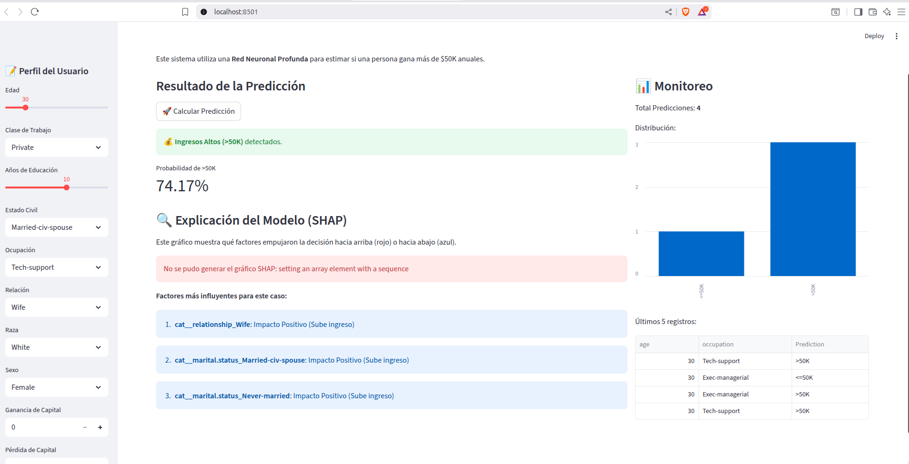

# ACIF104-Sumativa1-Grupo1
En este repositorio podran encontrar los elementos utilizados en el desarrollo de la actividad Sumativa 1, del curso Aprendizaje de Maquina APTRC106 de la Universidad Andrés Bello.

# 💰 Predicción de Ingresos con Deep Learning (Adult Census Dataset)


Este proyecto aborda la problemática de la clasificación de ingresos utilizando el famoso conjunto de datos **Adult Census Income**. El objetivo principal es desarrollar un modelo de Aprendizaje Automático capaz de predecir si una persona gana más de **$50,000 anuales**, basándose en características demográficas y laborales.

Este trabajo corresponde a la **Evaluación Sumativa (Fase 2)** del curso de Aprendizaje de Máquinas.

## 📋 Tabla de Contenidos
- [Descripción del Problema](#-descripción-del-problema)
- [Metodología](#-metodología)
- [Tecnologías Utilizadas](#-tecnologías-utilizadas)
- [Resultados Clave](#-resultados-clave)
- [Instalación y Uso](#-instalación-y-uso)
- [Estructura del Repositorio](#-estructura-del-repositorio)
- [Autores](#-autores)

## 🧐 Descripción del Problema
La desigualdad de ingresos y los factores que influyen en ella son temas críticos. Utilizando datos del censo de 1994, buscamos construir un modelo predictivo robusto que pueda identificar patrones asociados a altos ingresos.

El desafío técnico principal es el **fuerte desbalance de clases** (solo el ~24% de los registros corresponden a ingresos `>50K`), lo que requiere estrategias específicas de modelado y evaluación.

## 🚀 Metodología
El proyecto sigue un flujo de trabajo de Ciencia de Datos riguroso:

1.  **EDA y Limpieza:** Manejo de valores nulos (`?`), análisis de outliers y eliminación de redundancias (`education` vs `education-num`).
2.  **Preprocesamiento:** Pipeline con `StandardScaler` para numéricas y `OneHotEncoder` para categóricas.
3.  **Machine Learning Clásico (Baseline):** Comparativa entre Regresión Logística, Random Forest y SVM.
4.  **Estrategias de Balanceo:** Pruebas con *Baseline*, *SMOTE* y *Class Weights*.
5.  **Deep Learning:** Implementación y comparación de tres arquitecturas:
    * MLP Básico.
    * MLP con Regularización (Dropout).
    * Arquitectura Wide & Deep.
6.  **Refinamiento:** Ajuste de hiperparámetros automatizado usando **KerasTuner**.
7.  **Explicabilidad:** Análisis interpretativo del modelo final utilizando **SHAP** (SHapley Additive exPlanations).

## 🛠 Tecnologías Utilizadas
* **Python 3**
* **Pandas & NumPy:** Manipulación de datos.
* **Matplotlib & Seaborn:** Visualización de datos.
* **Scikit-Learn:** Preprocesamiento y modelos clásicos.
* **TensorFlow / Keras:** Construcción de redes neuronales.
* **Keras Tuner:** Optimización de hiperparámetros.
* **Imbalanced-learn:** Técnica SMOTE.
* **SHAP:** Interpretabilidad del modelo.

## 🏆 Resultados Clave

Tras experimentar con múltiples arquitecturas, el modelo **MLP con Dropout (30%)** resultó ser el ganador, superando incluso a modelos optimizados automáticamente y arquitecturas híbridas complejas. Esto demostró la importancia de la regularización simple frente al desbalance de datos.

| Modelo | F1-Score (>50K) | AUC-ROC | Conclusión |
| :--- | :---: | :---: | :--- |
| **MLP + Dropout (Ganador)** | **0.6836** | **0.9071** | Mejor equilibrio y generalización. |
| Wide & Deep | 0.6812 | 0.9058 | Muy competitivo, arquitectura robusta. |
| MLP Optimizado (Tuner) | 0.6804 | 0.9070 | Excelente AUC, pero menor F1. |
| MLP Básico | 0.6774 | 0.9024 | Buen baseline, tiende al sobreajuste. |

**Insights de SHAP:**
El análisis de interpretabilidad reveló que el **Estado Civil** (específicamente estar casado), la **Edad**, los **Años de Educación** y las **Ganancias de Capital** son los predictores más fuertes para tener ingresos altos.

## 💻 Instalación y Uso

### Ejecución en Google Colab

Si prefieres ejecutar el proyecto en la nube sin instalar nada en tu equipo, sigue estos pasos:

1.  **Abrir el Notebook:**
    Sube el archivo `ACIF104_S6_Grupo13.ipynb` a tu Google Drive y ábrelo con Google Colab, o ábrelo directamente desde GitHub.

2.  **Montar el Repositorio y Cargar el Dataset:**
    Para asegurarte de que el notebook tenga acceso al archivo `adult.csv` y a todos los scripts, ejecuta el siguiente comando en la **primera celda** del notebook:

    ```python
    # Clona el repositorio dentro del entorno de Colab
    !git clone [https://github.com/MaidoniaN/ACIF104-Sumativa1-Grupo1.git](https://github.com/MaidoniaN/ACIF104-Sumativa1-Grupo1.git)

    # Cambia el directorio de trabajo a la carpeta del proyecto
    %cd ACIF104-Sumativa1-Grupo1
    ```
    *Esto descargará automáticamente el dataset y los archivos necesarios.*

3.  **Instalar Librerías:**
    En una celda siguiente, ejecuta:
    ```python
    !pip install -r requirements.txt
    ```

4.  **Ejecutar Paso a Paso:**
    * Una vez configurado el entorno, ve al menú superior **"Entorno de ejecución"** -> **"Ejecutar todas"** para correr el proyecto completo.
    * Alternativamente, presiona `Shift + Enter` en cada celda para ejecutar el análisis secuencialmente y ver los gráficos interactivos.


## 📱 Aplicación Web (Prototipo Funcional)

Como parte de los requisitos de despliegue, se desarrolló un prototipo funcional utilizando **Streamlit**. Esta aplicación permite a un usuario interactuar con el modelo final, ingresar nuevos datos y obtener una predicción en tiempo real, junto con una explicación de la decisión.

### Estructura de la App
* **Backend:** Python + TensorFlow (Carga del modelo `MLP con Dropout`).
* **Frontend:** Interfaz web reactiva construida con Streamlit.
* **XAI:** Integración de gráficos **SHAP** para explicar cada predicción individualmente.
* **Monitoreo:** Registro automático de todas las consultas en un archivo `prediction_logs.csv`.

### ⚙️ Instrucciones para Ejecutar la App Localmente

Debido a posibles diferencias de versiones entre Google Colab y entornos locales, se incluye un script de "re-entrenamiento ligero" (`entrenar_local.py`) que asegura que los objetos serializados (scalers, encoders) sean compatibles con tu PC.

**1. Preparar el entorno:**
Asegúrate de tener el archivo `adult.csv` en la carpeta `API` (o raíz).

```bash
# Crear y activar entorno virtual
python3 -m venv venv
source venv/bin/activate

# Instalar librerías
pip install streamlit pandas numpy tensorflow joblib shap matplotlib scikit-learn imbalanced-learn

# Generar Artefactos Locales (Importante): Ejecuta este script para generar el modelo y los preprocesadores compatibles con tu sistema operativo:
python3 entrenar_local.py

# Lanzar la Aplicación:
streamlit run app.py

```
### API Corriendo


## 📂 Estructura del Repositorio

```text
├── ACIF104_S6_Grupo13.ipynb    # Notebook principal con todo el análisis y modelado (Deep Learning)
├── ACIF104_S6_Grupo13.pdf      # Informe final del proyecto (Evaluación Sumativa)
├── requirements.txt            # Lista de dependencias y librerías necesarias
├── README.md                   # Documentación del proyecto
├── API/                        # Carpeta de la aplicación web
│   ├── app.py                  # Código fuente de la aplicación Streamlit (Frontend + Backend)
│   ├── adult.csv               # Dataset utilizado por el modelo y la app
│   ├── entrenar_local.py       # Script auxiliar para generar modelos compatibles localmente
│   ├── modelo_ingresos.keras   # Modelo de Red Neuronal entrenado
│   ├── preprocessor.joblib     # Pipeline de preprocesamiento serializado
│   ├── shap_background.joblib  # Datos de fondo para explicabilidad SHAP
│   └── prediction_logs.csv     # Registro (log) de las predicciones realizadas
└── ACIF104_S6_Grupo13.docx   # Documento editable del informe

```
